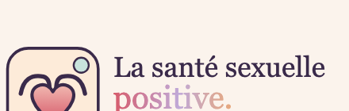
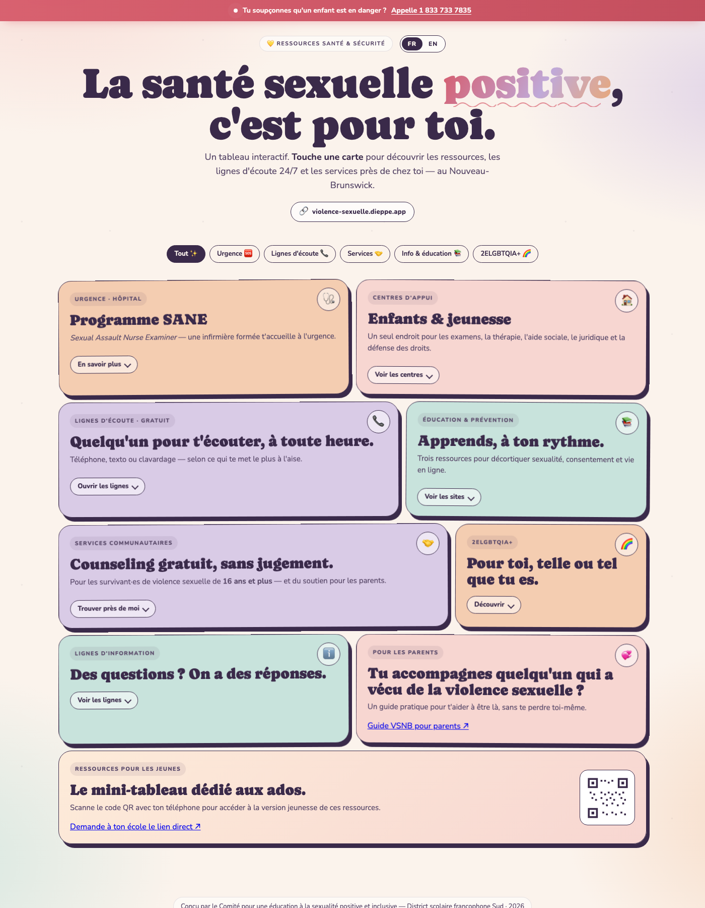
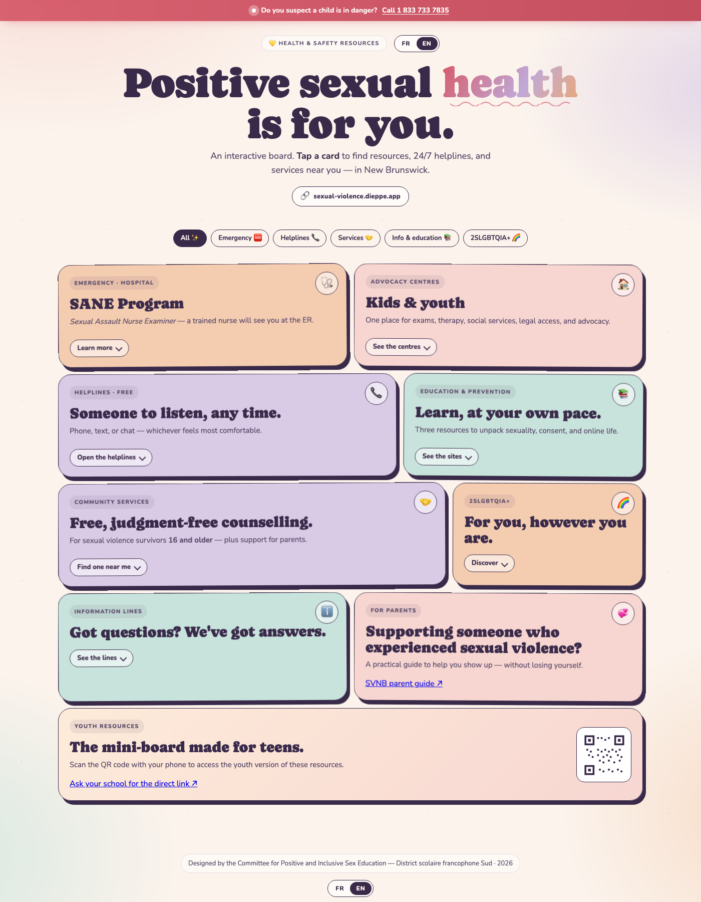
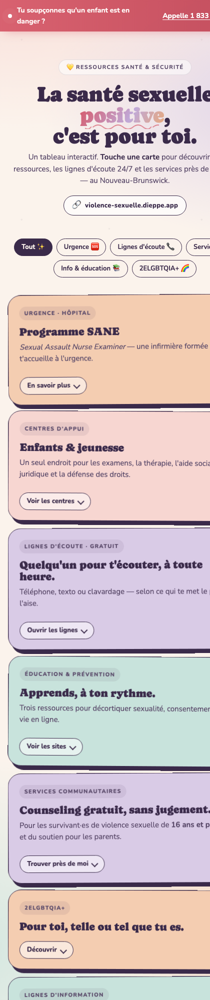
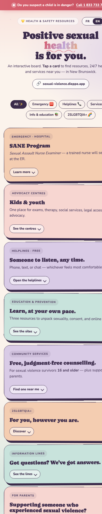

# La santé sexuelle positive · Positive sexual health

Bilingual (FR / EN) mobile-friendly single-page board displaying sexual-violence prevention and support resources for teens in New Brunswick — adapted from the *La santé sexuelle positive pour les parents* flyer by the Comité pour une éducation à la sexualité positive et inclusive, District scolaire francophone Sud, 2026.

Hosted at:

- 🇫🇷 [violence-sexuelle.dieppe.app](https://violence-sexuelle.dieppe.app)
- 🇬🇧 [sexual-violence.dieppe.app](https://sexual-violence.dieppe.app)

Both URLs serve the same `index.html`; the page auto-selects the language from the hostname (and respects `?lang=fr|en`, the FR/EN toggle, and `localStorage`).

## Preview

### Logo



### Desktop — Français



### Desktop — English



### Mobile — Français



### Mobile — English



## Features

- **Sticky emergency banner** — one tap to call the Ministry of Social Development
- **Category filters** — emergency, helplines, services, info, 2SLGBTQIA+
- **Expandable cards** — each reveals the relevant numbers and links
- **`tel:` everywhere** — call from mobile in one tap
- **Bilingual (FR / EN)** — toggle in header & footer; hostname-based default
- **Mobile-first** — bento grid collapses to single column under 760px
- **Pastel palette** taken from the original flyer
- **Distinctive typography** — *Caprasimo* (display) + *Nunito* (body)
- **Respects `prefers-reduced-motion`**

## Files

| File | Description |
| --- | --- |
| `index.html` | Single-page, self-contained (no build step) |
| `CNAME` | GitHub Pages custom domain |
| `logo.svg` | Full logo with wordmark |
| `favicon.svg` | Vector favicon |
| `favicon-32.png` | 32×32 raster fallback |
| `apple-touch-icon.png` | iOS 180×180 icon |
| `screenshots/` | Preview images |

## Usage

Open `index.html` in any browser — no server required.

```bash
open index.html
# or with explicit language:
open "index.html?lang=en"
```

Deploys to any static host (GitHub Pages, Cloudflare Pages, Netlify).
